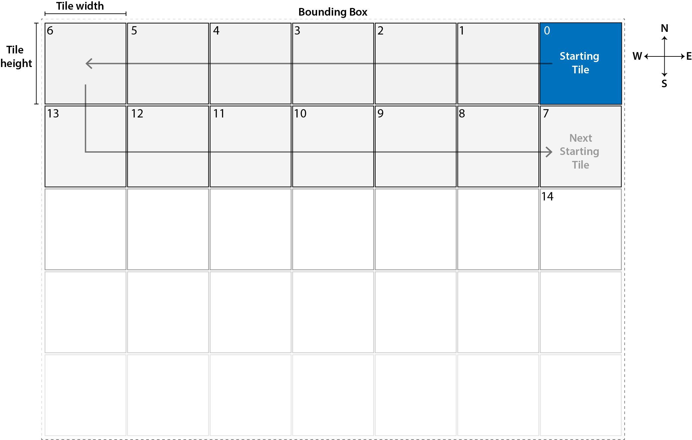

# overpass-api-tiles
Mbtiles generator using OSM data from Overpass-API

### Directory Structure
*Create the necessary folders as below*
```
Root
|--osm        # Download directory for .osm files
|--geojson    # Directory for .osm => .geojson files
|--mbtiles    # Directory for (merged .geojson) =>  .mbtile file
|
|--download.js            # Download .osm tiles from Overpass-API
|--download-limit.js      # Do another pass for 0kb .osm tiles (Due to hitting rate limit)
|--osm-to-geojson.js      # convert .osm to .geojson files
\--geojson-merge.js       # Merge .geojson files into single file
```

### Process
- Run `node download.js` to download .osm tiles. The map's bounding box is defined in the script
- The script will hit rate limit couple of times and download 0kb tiles. Run `node download-limit.js` till all tiles have been downloaded.
- Run `node osm-to-geojson.js` to convert .osm to .geojson files

**NOTE**: Before running this script please install osmtogeojson npm module globally if you do not have one. Use command `npm install -g osmtogeojson`

- Run `node geojson-merge.js` to merge .geojson files into single file
- The final output will be a single .geojson in `mbtiles\output.geojson`
- Use [tippecanoe](https://github.com/mapbox/tippecanoe) to convert the output.geojson to a single .mbtile


You can serve these tiles using [tileserver-gl](https://github.com/klokantech/tileserver-gl)

### Tile Downloader Process
Just a visual reference of how sequence of how tiles are downloaded


### TODO
- Combine download.js and download-limit.js
- Accept argument for bounding box parameters
