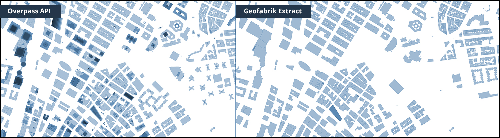

# Overpass API OSM Extracts
*Steps to download OSM data using Overpass API*


This method simplifies the downloading process of very large OSM data through Overpass API in form of multiple small `.osm` files.

OSM extracts from Overpass API may be preferred because it returns higher level of detail for building geometries in data rich cities like NYC. Otherwise, there are other sources to download the OSM data like through [Geofabrik Service](http://download.geofabrik.de/). Steps for that are documented [here](https://github.com/UrbanSystemsLab/Geofabrik-OSM-Extracts).



## Requirements

- Install osmtogeojson npm module globally `npm install -g osmtogeojson`
- Clone this repository to obtain the necessary scripts. 

```sh 
git clone https://github.com/UrbanSystemsLab/OverpassAPI-OSM-Extracts.git .
npm install -g osmtogeojson
npm install
```


## Directory Structure
```sh 
Root
|--osm        				# Download directory for .osm files
|--geojson    				# Directory for .osm => .geojson files
|--geojson-merged     # Directory for single merged .geojson
|
|--download.js            # Download .osm tiles from Overpass-API
|--osm-to-geojson.js      # convert .osm to .geojson files
|--geojson-merge.js       # Merge .geojson files into single file
|
|--config.json 						# Configuration parameters (Modify these)
```

## Steps
- Clone this repository
- Download OSM Tiles via Overpass API
- Convert OSM files to GeoJSON format
- Merge GeoJSON files to a single file
- Import to mongoDB
- Aggregate buildings in MongoDB
- Export Buildings
- Convert to JSON to GeoJSON
- Convert to GeoJSON to SHP File
- Convert GeoJSON to MBTiles

## Process

### 1. Download OSM Tiles
Update `config.json` with bounding box of the OSM area needed to be downloaded. Several `.osm` may be downloaded, proportional to the size of the bounding box.

```sh 
node download.js
```
If you are still hitting the rate limit, you can increase the retry interval in `download.js` 

```js
async.retry({ times: 10, interval: function(retryCount) { return 20 * 1000 * Math.pow(2, retryCount) } }, function(cb, results) {...})

// Change the value interval 20 * 1000 * Math.pow(2, retryCount) 
```

Alternatively, decrease the `tileSize` in `config.json`.

### 2. Convert OSM tiles to GeoJSON tiles
This will convert all the `.osm` files to `.geojson` format

```sh
node osm-to-geojson.js
```

### 3. Merge GeoJSON tiles to a single file
This script combines the `.geojson` files into a single file.

```sh
node geojson-merge.js
```

### 4. Import to mongoDB
Import all the features in the merged GeoJSON file to a MongoDB collection. Replace 'databaseName' with your MongoDB database name.

```sh
 cd geojson-merged
 jq  ".features" --compact-output output.geojson > features.json
 mongoimport --db databaseName -c features --file "features.json" --jsonArray
```

### 5. Aggregate buildings in MongoDB
Run the mongo shell using mongod. In another shell run mongo command to perform the following to inspect and aggregate the necessary data.

Aggregate buildings from `features` collection into `buildings` collection. *Optionally*, add some arbitrary height to buildings that are missing the `properties.height` attribute.

```sh
# Count features with properties = Buildings:True OR Height:True
db.features.find({ $or : [{'properties.building' : {$exists : true} },{'properties.height' : {$exists : true} }]}).count()

# Aggregate those features to buildings collection
db.features.aggregate([{ $match: {$or : [{'properties.building' : {$exists : true} },{'properties.height' : {$exists : true} }]} },{ $out: "buildings" }])

# Count buildings that are missing height attribute
db.buildings.count({'properties.height': {$exists : false}})

# Set default height for those buildings to '3'
db.buildings.find({'properties.height': {$exists : false}}).forEach(function(obj) {db.buildings.update({_id : obj._id},{$set : {'properties.height' : parseFloat('3')}});});

```

⚠️ **Note**: Some third-party apps and libraries expect strict data type usage. For example, Mapbox-gl-js library expects height (for 3D-building-extrusion) as number instead of string. Use the following steps to convert the field in MongoDB to correct data type

```sh
# Count the features that have height encoded as string
db.buildings.find({'properties.height' : {$type : 2} }).count()

# Convert string data type to float 
db.buildings.find({'properties.height': {$exists : 'true'}}).forEach(function(obj) { 
	db.buildings.update({_id : obj._id},
	{
		$set : {'properties.height' : parseFloat(obj.properties.height)}
	});
});

```

### 6. Export Buildings

Export the collection that contains the needed data out to a JSON Array

```sh
mongoexport --db databaseName -c buildings --out "building_export.json" --jsonArray 
```

### 7. Convert to JSON to GeoJSON
```sh
# Input: building_export.json 
# Output: buildings.geojson

echo '{ "type": "FeatureCollection","features":'  >> buildings.geojson ; cat  building_export.json >> buildings.geojson ; echo '}' >> buildings.geojson
```

### 8. Convert to GeoJSON to SHP File
Create a ESRI Shapefile from the exported GeoJSON data.

```sh
ogr2ogr -f "ESRI Shapefile" data.shp "buildings.geojson" -skipfailures
```

### 9. Convert GeoJSON to MBTiles
Use [tippecanoe](https://github.com/mapbox/tippecanoe) to convert the merged GeoJSON file to a MBTiles

```sh
tippecanoe -pd -z 14 -n buildings-tileset-name -l buildings-layer-name -f -o buildings.mbtiles buildings.geojson
```

These tiles can ber served locally using [tileserver-gl](https://github.com/klokantech/tileserver-gl)

--- 

## Tile Download Process
A visual reference of how OSM data is downloaded by `download.js` as multiple tile extracts.

